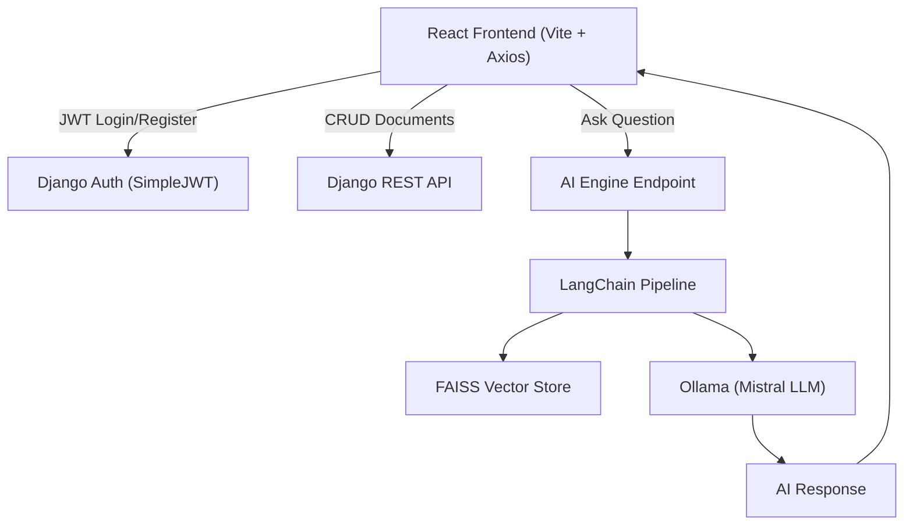

---

# 🤖 AI-Powered Document Assistant

### *Full-Stack RAG System with Local LLM Inference (Django + React + Ollama)*

A production-ready full-stack AI application combining **secure document management** with **local AI intelligence** using Retrieval-Augmented Generation (RAG).

This system uses a **Django REST backend**, a modern **React + Vite frontend**, and a **local Mistral LLM via Ollama**, ensuring complete privacy, zero API costs, and full control over AI inference.

---

# 🚀 Key Features

## 🔐 Authentication

* Secure JWT-based authentication
* User registration and login
* Protected API endpoints
* Token-based session persistence

## 📂 Document Management

* Create, read, update, delete documents
* User-specific document isolation
* Real-time document refresh
* Secure backend validation

## 🧠 AI Intelligence (Local, Private, Free)

* Local inference using Ollama (Mistral model)
* No OpenAI or paid API required
* No rate limits
* Fully offline capable

## ⚡ Retrieval-Augmented Generation (RAG)

* FAISS vector search
* Ollama embeddings
* Context-aware AI answers
* LangChain orchestration

## 💻 Modern React Frontend

* Built with React + Vite
* JWT authentication flow
* Axios service architecture
* Secure API integration
* Modular, scalable structure

## 🛡️ Secure and Production-Ready Architecture

* Backend authorization enforcement
* API-based frontend communication
* Service-based frontend architecture
* DevOps-ready structure

---

# 🏗️ System Architecture



---

# 🛠️ Tech Stack

## Backend

* Python 3.11+
* Django
* Django REST Framework
* SimpleJWT

## Frontend

* React 18
* Vite
* TypeScript
* Axios

## AI Stack

* Ollama
* Mistral model
* LangChain
* FAISS

## Database

* SQLite (Development)
* PostgreSQL (Production ready)

## DevOps Ready

* Docker (planned)
* Jenkins CI/CD (planned)
* GitHub integration

---

# 📂 Project Structure

```
ai-knowledge-assistant/

backend/
│
├── accounts/
├── documents/
├── ai_engine/
├── ai_knowledge_assistant/
├── manage.py
├── requirements.txt
└── venv/

frontend/
│
├── src/
│   ├── api/
│   ├── services/
│   ├── components/
│   ├── pages/
│   └── App.tsx
│
├── package.json
├── vite.config.ts
└── index.html
```

---

# ⚡ Setup Guide

# 1. Install Ollama and Mistral

Download Ollama:

[https://ollama.com/download](https://ollama.com/download)

Pull model:

```
ollama pull mistral
```

Start Ollama:

```
ollama run mistral
```

Leave it running.

---

# 2. Backend Setup

```
cd backend

python -m venv venv

venv\Scripts\activate

pip install -r requirements.txt

python manage.py migrate

python manage.py runserver
```

Backend runs at:

```
http://127.0.0.1:8000
```

---

# 3. Frontend Setup

```
cd frontend

npm install

npm run dev
```

Frontend runs at:

```
http://localhost:5173
```

---

# 🔐 Authentication Flow

Login:

```
POST /api/auth/login/
```

Response:

```
access_token stored in localStorage
```

Frontend automatically sends token via Axios interceptor:

```
Authorization: Bearer <token>
```

---

# 📡 API Reference

## Authentication

```
POST /api/auth/register/
POST /api/auth/login/
```

---

## Documents

```
GET /api/documents/
POST /api/documents/
PUT /api/documents/{id}/
DELETE /api/documents/{id}/
```

---

## AI Question Answering

```
POST /api/ask/
```

Request:

```
{
  "document_id": 1,
  "question": "Explain the main concept"
}
```

Response:

```
{
  "answer": "AI generated answer based on document context"
}
```

---

# 🧠 How the AI Works

Step 1: Document stored in database

Step 2: Question sent from React frontend

Step 3: Django sends document to LangChain

Step 4: FAISS retrieves relevant context

Step 5: Ollama generates response locally

Step 6: Response returned to frontend

---

# 💻 Frontend Architecture

Frontend uses service-based architecture:

```
api/
  http.ts            → Axios instance

services/
  authService.ts    → Login/Register
  documentService.ts → CRUD operations
  aiService.ts      → AI requests

components/
  DashboardPage.tsx
  CreateDocumentPage.tsx
  AskAIPage.tsx
```

Advantages:

* clean separation
* scalable
* production-ready

---

# 🔒 Security Features

* JWT authentication
* Protected API routes
* Token interceptor
* User data isolation
* Backend permission enforcement

---

# ⚡ Performance Features

* Local AI inference
* No network latency to OpenAI
* Fast vector retrieval using FAISS
* Optimized for low RAM systems

---

# 🚀 DevOps Ready

Designed for:

* Docker containerization
* Jenkins CI/CD pipelines
* Production deployment
* Nginx / Apache hosting

---

# 🔮 Future Improvements

* Docker support
* PostgreSQL integration
* Redis caching
* CI/CD pipeline with Jenkins
* Production deployment configs
* Role-based access control

---

# 👨‍💻 Author

AI Document Assistant
Full-Stack AI + Django + React + DevOps Project
